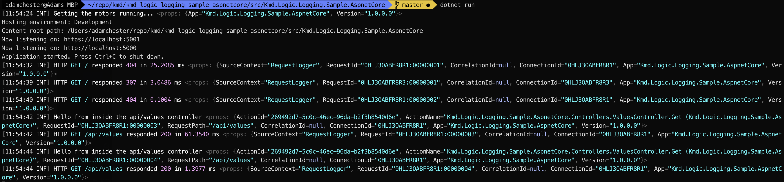
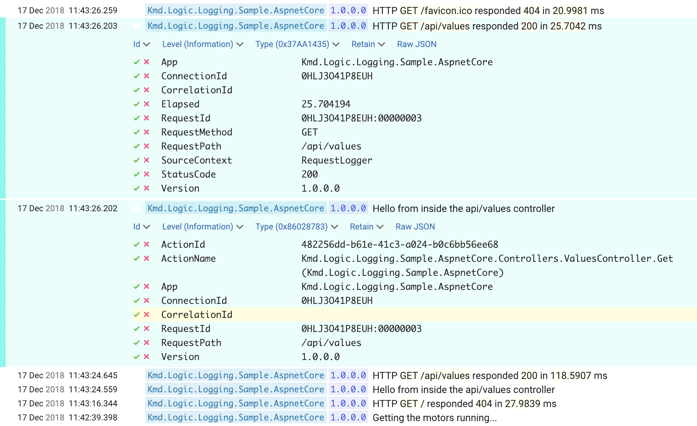

# kmd-logic-logging-sample-aspnetcore

A concrete example of how we recommend logging in ASPNET Core.

To run the sample, just `dotnet run` after [installing the dotnet core SDK](https://dotnet.microsoft.com/download/dotnet-core/2.2), and navigate to `http://localhost:5000/api/values`.

If you are running from a console/terminal, you should see output similar to:

If you [install a copy of Seq](https://docs.getseq.net/docs/getting-started#section-installing-the-seq-server) (or run [`./seq.sh`](./seq.sh) if you have bash + docker), you can navigate to `http://localhost:5341/` and you should see output similar to:

